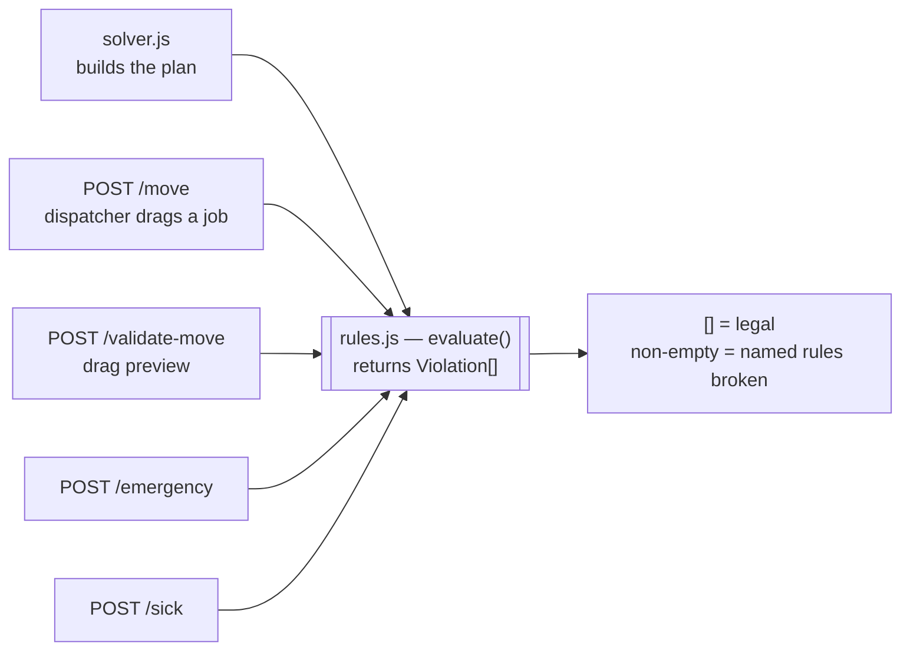
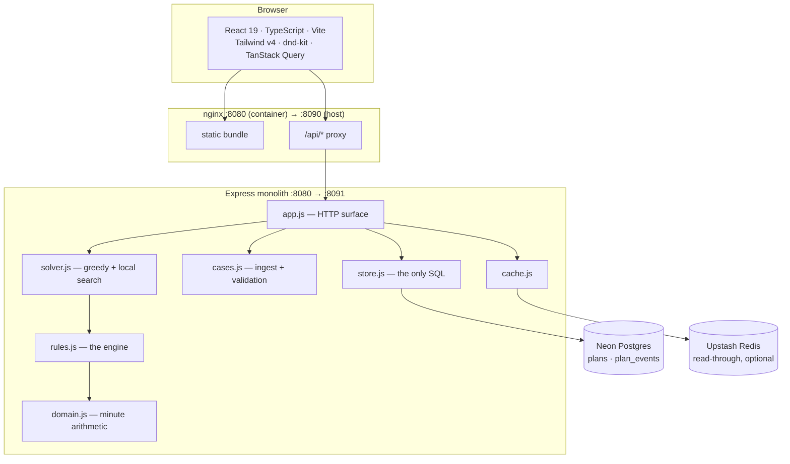
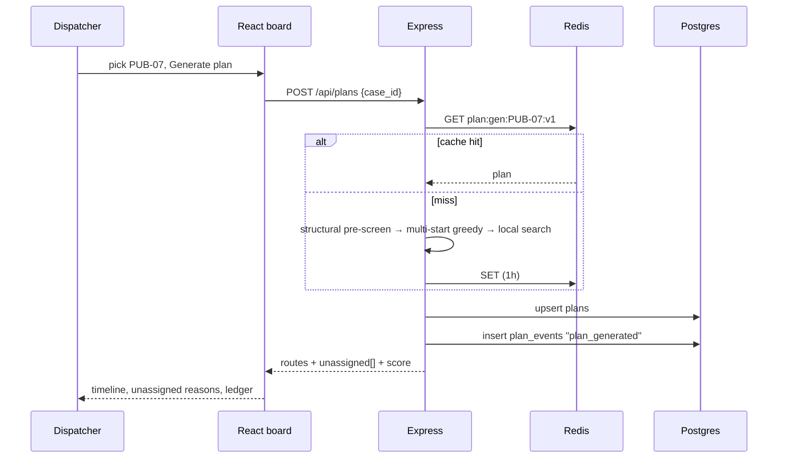
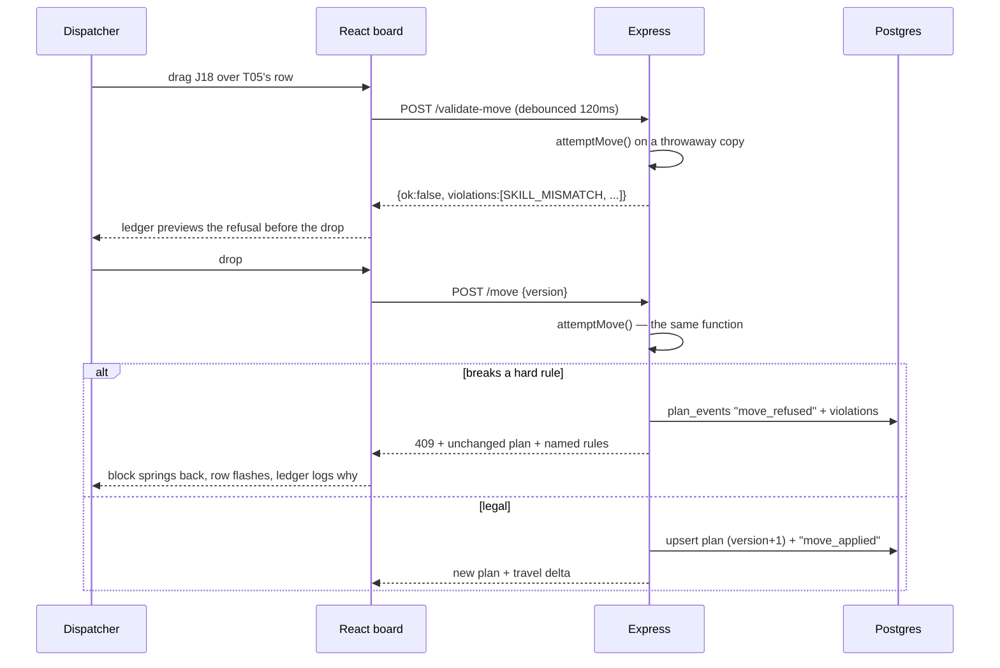
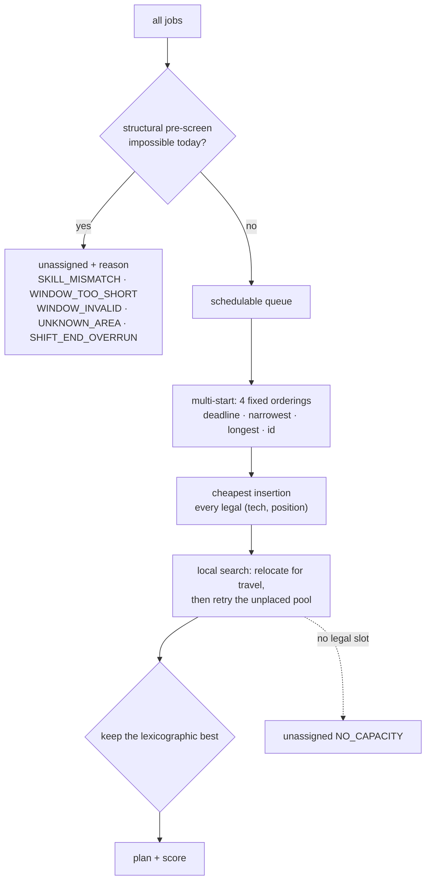
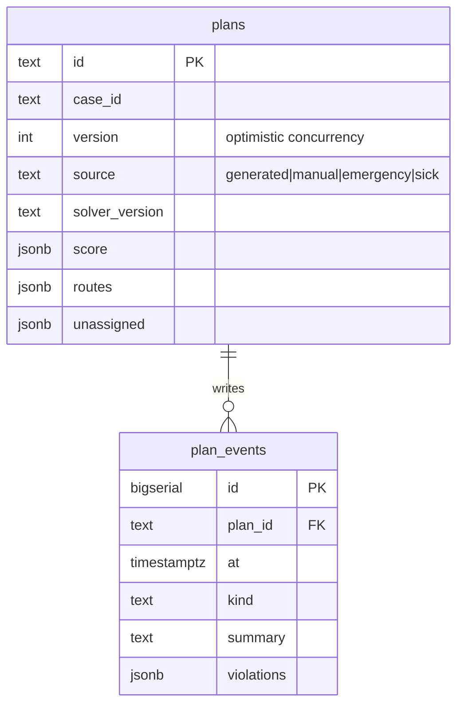
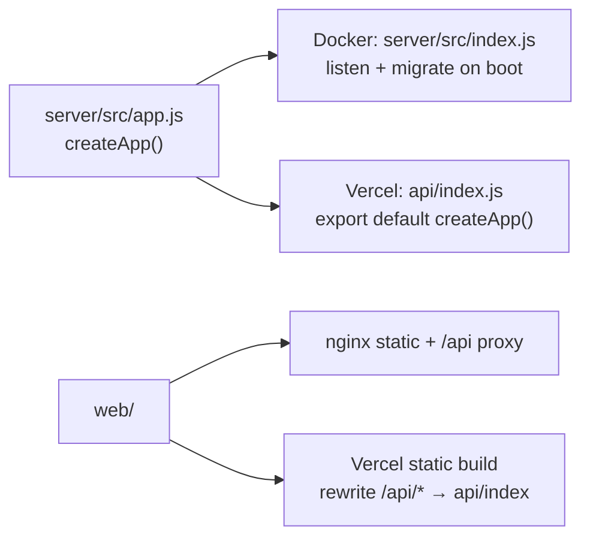

# Architecture

## The decision everything else follows from

**There is exactly one hard-rule engine, and every caller goes through it.**

If the solver and the manual-move check were separate code, they would drift, and
the verdict shown to the dispatcher would stop matching the plan on screen. One
function, typed rule codes, one vocabulary of reasons in the UI.

It is also how the brief's hard constraint is met — *"the unassigned jobs list
with a reason for each one is required. Silence is not an answer."* Every
rejection anywhere in this system is a `Violation` value, never a log line.

## Stack

Dependency direction is one-way: `app → solver → rules → domain`, and
`app → store → database`. `rules.js` and `domain.js` import nothing else from
the project — they cannot reach a database or a request, which is what makes the
engine trustworthy.

## A day plan, end to end

## The manual move — AT4

`validate-move` and `move` call one function; validate discards its copy. The
drag preview and the drop result cannot disagree. A refused move is a **409 with
the violations attached**, not a bare 400 — and it is written to the ledger,
because a dispatcher's failed attempt and the rule that blocked it is exactly the
history worth keeping.

## The solver

Stated goal, lexicographic: **maximise assigned jobs; among equal, minimise total
travel minutes.**

Cheapest insertion is order-sensitive and no single ordering wins on every case —
a single-ordering greedy actually lost to the naive baseline on PUB-03, 07 and
12. Multi-start fixes that without giving up **determinism**: fixed orderings,
fixed tie-breaks, no RNG, so judges re-running a case get the same board.

The pre-screen exists to separate *"impossible today"* from *"no room left"*.
That distinction is what makes the unassigned list useful to a dispatcher, and
the sample data is built to test it: all 25 public cases plant at least one job
no technician can do, and 16 plant a job whose window is shorter than its own
duration.

## Data model

The 25 cases are read-only reference data, embedded in the image and validated at
ingest — there is nothing to migrate and nothing to keep in sync. Only *plans*
and *what happened to them* are persisted.

`plan_events` is append-only and is the backing store for the Rule Ledger in the
UI. `version` gives optimistic concurrency: a `move` carrying a stale version
gets `409 STALE_PLAN` and the current plan, so two dispatchers cannot silently
clobber each other.

## Caching

Plan generation is the only expensive operation, and it is **pure** — the same
case always yields the same plan. That is what makes it safely cacheable, and
part of why the solver is deterministic.

| Key | TTL | Why |
|---|---|---|
| `case:{id}:v1` | 24h | read on every board load, never changes |
| `plan:gen:{case}:{solver_version}` | 1h | keyed on solver version, so shipping a new solver invalidates everything without a flush |
| `mv:{plan}:{version}:{job}:{tech}` | 60s | drag-hover fires the same validation repeatedly; keyed on plan version, so any mutation invalidates the generation |

The cache is read-through and **always optional**. Every path falls back to
computing the value, so a Redis outage costs latency, never correctness. Nothing
cached is ever the source of truth for a rule verdict.

## One codebase, two hosts

The same Express app runs in both places. Docker adds the listener and boot
migrations; Vercel imports the app directly.

## Frontend

The board's visual encoding *is* its argument: **service is solid, travel is
hatched, idle is nothing — the bare ruled ground showing through.** A wasteful
plan reads as holes. The header's coverage % and the objective function are the
same quantity.

One hot colour exists on the page (`#D8402A`) and it is reserved exclusively for
a broken hard rule. Nothing else is ever red, so a dispatcher learns in seconds
what red means.

The **Rule Ledger** is the signature element: an append-only right rail reading
from `plan_events`, which doubles as a live verdict preview during a drag. It is
*"silence is not an answer"* made literal — nothing happens on this board without
a written reason.

## Known limitations

- **Overnight shifts are rejected**, not wrapped. A technician with
  `22:00–06:00` is flagged `INVALID_SHIFT` and excluded rather than silently
  interpreted.
- **A job must be fully contained in its window.** The brief is ambiguous;
  the stricter reading is the safer one for a promise made to a customer.
- Local search is relocate-only within a time budget. Swap and 2-opt would
  likely find more, and `partial: true` is reported when the budget runs out.
- `web/src/mocks/planner.ts` is a browser fixture kept for offline demos
  (`VITE_USE_MOCK=1`). It is not the rule engine and is not in the default path.
